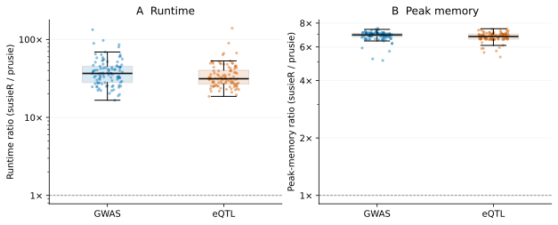

# prusie

prusie fits the SuSiE model to association summary statistics and signed linkage
disequilibrium (LD). A Python API connects to Rust computation and returns
variant posterior inclusion probabilities (PIPs), credible sets and posterior
effect summaries.

<!-- generated:highlights:start -->

| Analysis | Maximum absolute PIP difference | Paired runtime speedup¹ | Median peak-memory ratio² |
| --- | --- | --- | --- |
| GWAS | 9.14e-09 | 37.4× | 6.94× |
| eQTL | 1.22e-08 | 33.6× | 6.8× |

100 GWAS locus analyses and 100 eQTL analyses, each with 103–4162 variants, compared with susieR 0.16.6. ¹ Geometric mean of per-case ratios of median runtimes (susieR/prusie). ² Median per-case ratio of full-process peak memory (susieR/prusie). Results reanalyze measurements of prusie 0.2.3rc4 made on 6 October 2026; inference code is unchanged.
<!-- generated:highlights:end -->



See [numerical accuracy](docs/numerical_accuracy.md) and
[performance](docs/performance.md) for the data, absolute times, methods and
measurement environment.

## Installation

Install from source with Python ≥3.10, the Rust toolchain in
`rust-toolchain.toml`, a C linker and Python development headers:

```sh
git clone https://github.com/LucaJiang/prusie.git
cd prusie
python -m venv .venv
. .venv/bin/activate
python -m pip install .
```

NumPy is the only Python runtime dependency. Fitting requires neither R nor
Rust after installation. See [installation](docs/install.md) for build details
and the environments tested.

## Quick start

The installed package includes an independent 500-variant synthetic example.
Run this from any directory, offline:

```python
import numpy as np
import prusie

example = prusie.load_example()
fit = prusie.susie_rss(**example["inputs"], **example["parameters"])
print("Converged:", fit.converged, "Iterations:", fit.niter)
lead = int(np.argmax(fit.pip))
print(f"{fit.variant_ids[lead]}: PIP={fit.pip[lead]:.3f}")
for k, component in enumerate(fit.sets["cs_index"]):
    print(int(component), fit.variant_ids[fit.sets["cs"][k]].tolist(),
          "Posterior mass:", float(fit.sets["coverage"][k]))
```

A PIP summarizes variant inclusion across effects; each credible set belongs to
an original SuSiE component. The [tutorial](docs/example.md) explains input
preparation, convergence, posterior mass, purity and saving results.

## Documentation

Browse the [documentation site](https://lucajiang.github.io/prusie/),
[statistical model](docs/model.md), [API](docs/api.md),
[implementation](docs/implementation.md) and [model support](docs/compatibility.md).
[Reproducibility](docs/reproducibility.md) provides separate entrances for
regenerating tables/figures and rerunning fits from inputs.

## Citation and license

Cite [SuSiE, Wang et al. (2020)](https://doi.org/10.1111/rssb.12388) and
[SuSiE-RSS, Zou et al. (2022)](https://doi.org/10.1371/journal.pgen.1010299),
and identify prusie 0.2.3rc6 using [CITATION.cff](CITATION.cff).
Author and maintainer: Wenxin Jiang.

GPL-3.0-or-later. [LICENSE](LICENSE) and
[third-party notices](THIRD_PARTY_NOTICES.md) retain upstream code and data
attribution.
