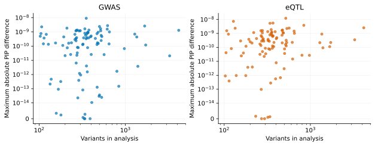
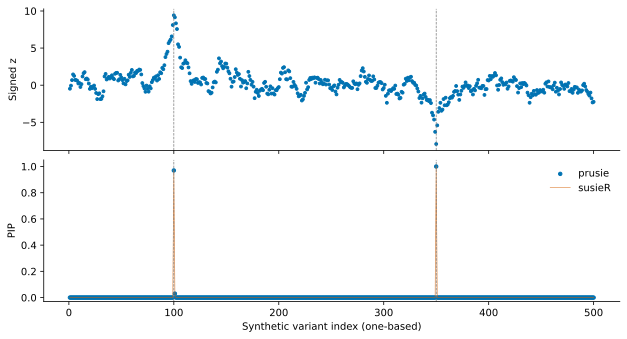

# Numerical accuracy

The real-data comparison uses prusie 0.2.3rc4 and susieR 0.16.6 at commit
`8e56a8e038e989856d106d9ca5175cc664fea9d2`. It reanalyzes saved full fits from
6 October 2026 using the matched inputs and parameters described in
[performance methods](performance.md#methods). Inference source has not changed.

## Variant inclusion probabilities

<!-- generated:maxima:start -->

| Analysis | Analyses | Variants per analysis | Maximum absolute PIP difference | Trace: case / variant index (zero-based) |
| --- | --- | --- | --- | --- |
| GWAS | 100 | 103–4162 | 9.14e-09 | region16/gwas / 49 |
| eQTL | 100 | 103–4162 | 1.22e-08 | region31/eqtl / 238 |

Across the evaluated GWAS analyses, the maximum absolute difference in variant PIPs relative to susieR 0.16.6 was 9.1396109e-09. Across the evaluated eQTL analyses, the maximum absolute difference in variant PIPs relative to susieR 0.16.6 was 1.2204966e-08.
<!-- generated:maxima:end -->

The numerical criterion is absolute PIP difference ≤10⁻⁵ with zero relative
tolerance, together with input/model/probability validity. The table reports
observed elementwise maxima, rather than that threshold. Each maximum is
traceable to a zero-based variant index, both fitted values and hashes of the
two raw fit records in the [machine summary](assets/r_comparison_summary.json).

The vertical axis is symmetric-log with a linear interval below 10⁻¹⁴; exact
zeros are retained at zero. [Vector PDF](assets/pip_accuracy.pdf).

<!-- generated:limits:start -->
region25/gwas: prusie 100 iterations, susieR 100 iterations, both unconverged. Both calls completed and their outputs enter the numerical maxima and timing summaries.
<!-- generated:limits:end -->

## Posterior arrays, Bayes factors and objective

<!-- generated:errors:start -->

| Quantity | Scale / units | GWAS maximum absolute difference | eQTL maximum absolute difference |
| --- | --- | --- | --- |
| alpha | Probability | 9.14e-09 | 1.22e-08 |
| mu | Standardized effect | 5.26e-10 | 2.34e-08 |
| mu2 | Squared standardized effect | 1.39e-10 | 3.7e-09 |
| lbf_variable | Natural-log BF | 2.82e-05 | 3.39e-07 |
| lbf | Natural-log BF | 2.82e-05 | 2.74e-07 |
| V | Squared effect | 4.08e-06 | 1.49e-07 |
| sigma2 | Phenotype variance | 0 | 0 |
| elbo | Natural-log objective | 1e-05 | 3.92e-08 |
| KL | Natural-log divergence | 7.01e-08 | 1.17e-07 |

Maxima are computed elementwise across every valid analysis, including iteration-limit outputs. The machine summary includes the case, array index, both values at the maximum and reference magnitude for each field. ELBO traces are compared only with matching shapes; per-case records retain any shape mismatch.
<!-- generated:errors:end -->

PIP and alpha differences have probability units. Conditional effects are on
the fitted standardized predictor/phenotype scale for these z-input analyses;
mu2 is a second moment, not a variance. Component and variant log Bayes factors
use natural logarithms. Their numerical differences are recorded separately
from PIP. ELBO is the iteration objective before final low-variance trimming;
V, moments, Bayes factors and KL follow the finalization semantics described in
[results](results.md).

## Credible sets

<!-- generated:cs:start -->

| Analysis | prusie sets | susieR sets | Component/member differences | Maximum mass difference | Maximum purity difference |
| --- | --- | --- | --- | --- | --- |
| GWAS | 154 | 154 | 0 | 2.14e-09 | 8.88e-16 |
| eQTL | 97 | 97 | 0 | 2.59e-09 | 8.88e-16 |

Sets are matched by original component ID and compared as member sets; returned ordering does not affect the comparison. All actual masses, purity statistics and zero-based members are retained.
<!-- generated:cs:end -->

The requested mass is 0.95. Returned mass is the sum of the selected alpha
entries in the original component; purity uses every selected pair's absolute
correlation. The retained numerical records include independent checks of PIP
identity, alpha normalization, actual set mass and purity, including empty sets.
Convergence and the presence of a credible set are different properties.

## Independent toy example

<!-- generated:teaching:start -->
The independent 500-variant toy example fit converged in 3 iterations and returned 2 credible sets. Its maximum absolute PIP difference from the separately generated susieR 0.16.6 reference was 1.66e-10.
<!-- generated:teaching:end -->

The dashed lines mark the two simulated nonzero effects. This single toy
example has its own newly executed reference, generation script and packaged
inputs. See the [toy example tutorial](example.md) and [vector PDF](assets/teaching_fit.pdf).

## Reproduce the comparisons

[Retained records](assets/r_comparison_numerical.json) include the real panel
and a separately identified older synthetic regression panel. The older fixture
and references remain byte-for-byte regression inputs. The installed package's
independent toy example is checked against its separate packaged R reference
by `tests/test_packaged_example.py`.

The [reproducibility guide](reproducibility.md) distinguishes regeneration from
saved records, offline frozen-reference checks, and live-R fitting.
`tools/benchmark/compare_fits.py` compares original component IDs and retains all
field diagnostics. Existing frozen references and tolerances are unchanged.
