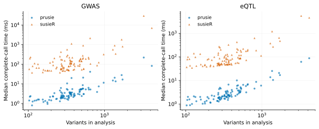
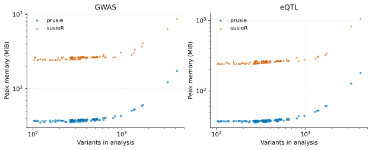

# Performance

The comparison measures complete fine-mapping calls in prusie 0.2.3rc4 and
susieR 0.16.6. The results below reanalyze retained measurements from 6 October
2026; they retain the original executable identities.

## Real-data panel

<!-- generated:panel:start -->
The fixed panel contains 100 genomic windows: 100 analyses of one FinnGen R10 inflammatory bowel disease GWAS (K11_IBD_STRICT; n = 412181) and 100 BLUEPRINT monocyte eQTL analyses (QTD000021; n = 191), representing 83 distinct genes. The interval metadata contain 0 overlapping window pairs. Analyses share study participants and reference samples; the 200 trait analyses are not 200 independent loci.
<!-- generated:panel:end -->

Signed LD was calculated from external 1000 Genomes reference samples: 99 FIN
founders for GWAS and 525 EUR founders for eQTL. Both analyses use the same
aligned variant intersection within each window, with their respective LD.
The input manifest preserves allele/order checks, exclusions and source hashes.

## Runtime and peak memory

<!-- generated:absolute:start -->

| Analysis | prusie time (ms) | susieR time (ms) | prusie peak memory (MiB) | susieR peak memory (MiB) |
| --- | --- | --- | --- | --- |
| GWAS | 2.98 | 106 | 37.8 | 266 |
| eQTL | 2.28 | 80 | 37.7 | 262 |

Runtime columns are medians across cases of each case’s median retained-repeat time. Memory columns are separate across-case medians of fresh-process peaks.

| Analysis | Runtime speedup, geometric mean | Per-case speedup median [Q1, Q3] | Speedup range | Median memory ratio | Median memory reduction |
| --- | --- | --- | --- | --- | --- |
| GWAS | 37.4× | 36.7 [28.1, 45.1] | 16.6–133 | 6.94× | 85.6% |
| eQTL | 33.6× | 31.3 [26.9, 40.2] | 18.6–139 | 6.8× | 85.3% |
<!-- generated:absolute:end -->

For case i, speedup si is median(time_susieR,i) / median(time_prusie,i), calculated
from retained repeats before grouping. The primary runtime summary is
**exp(mean(log si))**. This paired geometric mean differs from the ratio of
across-case median runtimes. Memory ratio is peak_susieR,i / peak_prusie,i;
reduction is 1 − peak_prusie,i / peak_susieR,i. The reported median ratios and
reductions each summarize those per-case values.

Boxes show median and quartiles; points show every eligible pair with deterministic
jitter. Ratios above the dashed 1× line favor prusie. Ratio axes are logarithmic.
[Vector PDF](assets/r_comparison.pdf).

Both axes are logarithmic; each point represents one analysis/backend.
[Vector PDF](assets/runtime_by_variants.pdf).

Peak memory includes interpreters, imports, inputs and the retained fit.
It describes process memory rather than algorithm workspace.
[Vector PDF](assets/memory_by_variants.pdf).

## Methods

Every successful pair with matching settings and seven finite positive retained
times is included, regardless of convergence, credible-set presence or numerical
difference. Each fit has a **100-iteration maximum**, with early convergence
using its actual iteration count. The pair reaching 100 iterations on both sides
is included. Failed or missing records retain explicit statuses and null metrics.
Numerical validity and timing eligibility are separate fields.

Timing surrounds the full public `susie_rss` call: validation, RSS preparation,
IBSS and posterior/credible-set summaries. Imports, file reads, explicit garbage
collection and exports are outside the clock. After one warmup, seven calls are
retained with one result held at a time. Backends run sequentially, with their
order alternating between cases; one numerical thread is used. Runtime uses a
monotonic high-resolution clock. Peak memory is measured independently in a
fresh process per case/backend, fitting once and retaining the full result;
Linux process high-water KiB is divided by 1024 to obtain MiB. SuSiE-RSS names
the summary-statistic model; process RSS in the measurement record means
resident set size.

The machine was an AMD EPYC 9754 system running Linux x86-64 with glibc 2.35.
The measured software was CPython 3.12.2, NumPy 2.2.6 and R 4.4.0. R loaded
OpenBLAS 0.3.20 (Zen, one thread); NumPy loaded its packaged OpenBLAS and the
native SER used the recorded optional glibc libmvec AVX2 path. Full loaded-library
identities, dependency versions and executable hashes are in the
[protocol and environment record](assets/r_comparison_protocol.json).
These measurements apply to the recorded binary and machine.

Real analyses use L=5, `tol=0.001`, `max_iter=100`, `scaled_prior_variance=0.2`,
fixed residual variance 1, optimized prior variance, normalized uniform priors,
no null column, standardization, coverage 0.95 and minimum absolute correlation
0.5. Complete matrix purity is used. `check_input=False` leaves finite,
symmetry, diagonal and range validation active; additional eigenvalue/projection
diagnostics are disabled in both compared settings. All parameters are in the
[case records](assets/r_comparison_cases.json).

## Repeat variability and retained records

<!-- generated:variability:start -->

| Analysis | prusie repeat IQR/median | susieR repeat IQR/median |
| --- | --- | --- |
| GWAS | 0.0617 | 0.0858 |
| eQTL | 0.0714 | 0.0867 |

Each entry is the median across cases of its seven-repeat IQR/median. Individual repeat times and case ranges are retained in the downloadable records.
<!-- generated:variability:end -->

The [TSV case table](assets/r_comparison_cases.tsv),
[retained repeats](assets/r_comparison_repeats.json),
[summary with operators](assets/r_comparison_summary.json) and
[numerical diagnostics](assets/r_comparison_numerical.json) contain full
fine-mapping records. The separate synthetic regression panel retains four
timed toy cases and three numerical diagnostics; it does not enter either
real-data group. The new [packaged example](example.md) has its own reference
and is not assigned those older timing values.

[Reproducibility](reproducibility.md) explains result-only regeneration and
input-level reruns. [Implementation](implementation.md) explains computational
mechanisms; the whole-call timings do not provide individual ablation estimates.
