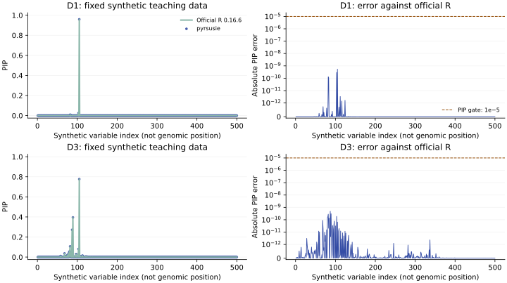

# Executed agreement with official R

> Prior-version evidence: the measurements and downloadable records below were
> executed before the public package rename. Historical `pyrsusie` labels
> identify those original binaries. The current package is `prusie`; see
> the [rename and migration checks](migration.md) for the new installation
> and unchanged numerical-source verification.

The installed **pyrsusie 0.2.3rc4** candidate passed the predeclared
PIP check on all seven fixed public teaching cases below, with input, model and
posterior validity checks. These are executed results, not an assertion of exact
equivalence for every field or every possible input. The capped one-iteration
case remains a nonconverged diagnostic.

## Reference and source identity

The reference is official susieR **0.16.6**, commit
`8e56a8e038e989856d106d9ca5175cc664fea9d2`, executed by the independent reference
lane in R 4.4.0 with Netlib BLAS and one numerical thread. The data are the
unmodified stored D1–D4 teaching fixtures from official coloc **6.0.3**, commit
`8f20f0bc5e60ffc99e4c2f787bd55fd30cfe7c45`. Each has exactly **500** distinct
synthetic variables and stored n=1000. No resimulation, padding, SNP subsetting
or selection based on agreement was performed. These are synthetic software
examples, not new biological evidence.

The tested numerical source is the A02-only candidate: B01's unmeasured
known-variance allocation change was reversed, and its correctness tests were
retained. Numerical-source manifest SHA256:
`c2e7334b3f4655cd6e36b5d528567c65e54ae9de4120cbeeda3521a01b44b91c`. [Exact source hashes](assets/numerical_source.json) identify
the Python, Rust and build files. Final performance selection is documented
separately; this numerical example is not a timing experiment.

| Runtime field | Observed value |
| --- | --- |
| Python | 3.12.2 |
| NumPy | 2.2.6 |
| Native backend | pyrsusie-rust/0.2.3-rc.4; susieR-reference/0.16.6@8e56a8e038e989856d106d9ca5175cc664fea9d2 |
| SER math route | optional_glibc_libmvec_avx2_masked_exp |
| Architecture | x86_64 |
| Input/reference manifest SHA256 | `c3485fe1c5da1bd7012401eb4d85cc860cc1c2fdbc26f055f4b25240cca66abe` |
| Shared checksum manifest SHA256 | `2e084ad2c77ecd48e8d07cddff8ea332c18efa93672141cf7e562fec3e8071ee` |

The [complete machine-readable evidence](assets/example_evidence.json) records
the executed parameters, per-input and order hashes, every compared field,
warnings and component-aligned diagnostics. The bundled `reference.lock.json`
and `reference_environment.json` provide pinned source archive/data hashes and
the actual R dependency versions. See [provenance](example_provenance.md).

## Reproduce the offline check

After installing the package from a source checkout or extracted archive:

```sh
python examples/check_example.py --output-dir example-results
```

Only the installed package and NumPy are required. The checker verifies
checksums, calls `prusie.susie_rss`, compares its newly computed PIPs to
independent frozen R outputs, writes numeric actual output and a JSON report,
and exits nonzero on a substantive mismatch. It never invokes R or refreshes
goldens. A version change is recorded rather than treated as a numerical failure.

## Exact model and cases

Primary fits use signed z = beta / √varbeta, stored signed LD r, n=1000, L=10,
max_iter=100, tol=0.001, coverage=0.95, min_abs_corr=0.5, n_purity=500,
standardize=True, estimate_prior_variance=True, estimate_prior_method="optim",
scaled_prior_variance=0.2, estimate_residual_variance=False,
check_null_threshold=0, prior_tol=1e-9, null_weight=0, refine=False,
track_fit=False and verbose=False. Float64 IBSS updates remain sequential.
No phenotype variance is guessed; this is the known-n z-RSS model.

D1/D2/D4 are stored single-signal teaching datasets; D3 has two stored causal
variables. D1_partial_zero changes only the prior weights: zero at every seventh
one-based index, one elsewhere. D3_strict_purity changes only min_abs_corr to1.
D3_one_iteration changes only max_iter to1 and is an explicit nonconvergence
diagnostic, excluded from the primary100-iteration scientific-fit description.
Full arguments and input metadata are frozen in `examples/data/parameters.json`
and `metadata.json`. The original variable order is fixed by `variants.tsv` on
both LD axes.

## Measured PIP and structural results

The numerical gate is **PIP absolute error ≤1e-5, rtol=0**, with input/model and
probability validity. Convergence, iterations, component arrays and CS differences
remain diagnostics. CS return order is immaterial: rows are compared by the
original zero-based component ID, without relabeling effects.

| Case | Maximum PIP error | Iterations native / R | Converged native / R | Native CS count | CS IDs and members | Gate |
| --- | --- | --- | --- | --- | --- | --- |
| D1 | 5.47e-10 | 2 / 2 | True / True | 1 | same | PASS |
| D2 | 2.01e-10 | 2 / 2 | True / True | 1 | same | PASS |
| D3 | 4.84e-10 | 8 / 8 | True / True | 2 | same | PASS |
| D4 | 8.81e-10 | 2 / 2 | True / True | 1 | same | PASS |
| D1_partial_zero | 1.6e-10 | 2 / 2 | True / True | 1 | same | PASS |
| D3_strict_purity | 4.84e-10 | 8 / 8 | True / True | 0 | same | PASS |
| D3_one_iteration | 3.55e-09 | 1 / 1 | False / False | 1 | same | PASS |



*D1 and D3 display the single- and multi-signal examples. Every case remains in
the table; the plot is not a selected acceptance panel. The error axis is
symmetric-log with a linear region below1e-12 so exact zeros remain visible.
The horizontal index is synthetic, not a genomic position.*

## Returned coverage and purity

Returned coverage is the alpha mass of each actual CS in its original component.
The checker independently uses that row and the returned members, and recomputes
complete-pair purity from signed LD. It does not replace returned coverage with
the requested0.95. These identity checks use fixed absolute1e-10 arithmetic
tolerance; they are distinct from the PIP comparison gate.

| Case | Original component (0-based) | Members (0-based) | Returned native mass | Absolute mass difference from R | Minimum absolute r |
| --- | --- | --- | --- | --- | --- |
| D1 | 0 | 104 | 0.959396812596 | 5.47e-10 | 1 |
| D2 | 0 | 102, 104, 108, 115 | 0.965522548049 | 7.82e-11 | 0.834750954 |
| D3 | 0 | 81, 102, 104 | 0.962856945063 | 3.31e-11 | 0.771180152 |
| D3 | 1 | 57, 67, 68, 72, 74, 79, 80, 83, 86, 88, 96, 107, 112 | 0.951751227277 | 1.96e-10 | 0.676934006 |
| D4 | 0 | 104, 155 | 0.965753529562 | 4.87e-10 | 0.710430289 |
| D1_partial_zero | 0 | 81, 82, 102 | 0.994879557081 | 1.75e-11 | 0.784894594 |
| D3_one_iteration | 0 | 102, 104 | 0.969776865766 | 7.79e-11 | 0.915096146 |

D3_strict_purity has **no credible sets**: member/index/coverage/purity arrays
are empty and coverage is unavailable, not zero. Its PIPs remain available.
The one-iteration diagnostic is not silently refitted; its returned values and
nonconvergence warnings remain in the evidence.

## Raw numerical diagnostics

These maxima are recorded even though intermediate equality is not the release
gate. No tolerance is increased after observing a difference. Additional lbf,
sigma2 and KL errors and native-snapshot comparisons appear in the JSON record.

| Case | alpha | mu | mu2 | lbf_variable | V | ELBO |
| --- | --- | --- | --- | --- | --- | --- |
| D1 | 5.47e-10 | 8.49e-10 | 4.28e-10 | 1.07e-07 | 1.38e-08 | 4.09e-12 |
| D2 | 2.01e-10 | 1.15e-10 | 5.37e-11 | 1.32e-08 | 1.44e-09 | 6.82e-13 |
| D3 | 4.84e-10 | 3.59e-10 | 1.29e-10 | 1.58e-07 | 9e-09 | 3.36e-08 |
| D4 | 8.81e-10 | 5.37e-10 | 2.11e-10 | 5.25e-08 | 4.09e-09 | 2.27e-12 |
| D1_partial_zero | 1.6e-10 | 1.35e-10 | 6.8e-11 | 1.49e-08 | 1.68e-09 | 3.41e-12 |
| D3_strict_purity | 4.84e-10 | 3.59e-10 | 1.29e-10 | 1.58e-07 | 9e-09 | 3.36e-08 |
| D3_one_iteration | 3.55e-09 | 1.07e-09 | 2.34e-10 | 3.69e-08 | 6.46e-09 | 7.2e-09 |

The checker recomputes alpha row sums, marginal PIP from active components,
returned CS coverage and purity; verifies SNP order, immutable input arrays,
model options and valid variances; and keeps official-R outputs, native frozen
snapshots and mathematical identities distinct. The native snapshot is useful
for reproducibility but is not an independent statistical oracle.

## Boundaries and intentional behavior

- The reference adds √ε before logging SER prior weights. A supplied zero weight
  is not a hard exclusion from active component posteriors. Final low-V trimming
  restores the exact normalized prior. Partial-zero weights here are an
  index-defined software edge case, not biological prior information.
- The native interface uses zero-based components and members and explicit empty
  CS arrays. R raw sets and one-based IDs are preserved separately in the bundle.
- Nonconvergence is a distinct status. Passing an arithmetic comparison does
  not make the one-iteration result a converged scientific inference.
- The teaching data do not provide genome build, ancestry, real coordinates or
  counted/effect alleles. Their synthetic variable identities must not be
  presented as real biological annotations. Stored sdY is retained, but the
  demonstrated z-RSS fit does not use a supplied phenotype variance.
- The supported Gaussian scope excludes nondefault initialization/refinement,
  individual-level regression, LD-mismatch models, mixture/infinitesimal priors,
  greedy updates and the other methods listed in [compatibility](compatibility.md).
  Invalid data are rejected rather than silently repairing LD.
- The separate private100-region/200-trait validation panel is real-region
  evidence and is not redistributed here. It is distinct from these synthetic
  public examples. Final-source PIP/model checks and downstream integration are
  accounted for by the independent release review; this report alone does not
  certify that panel or establish performance acceptance.

## Reference regeneration and review

The [provenance guide](example_provenance.md) and bundled regeneration scripts
describe the pinned R4.4.0/coloc6.0.3/susieR0.16.6 environment, exact archive/data
hashes and conversion. No floating reference installation is used. R input
round-trip doubles are preserved; exported reference arrays retain about15
significant digits, far below the frozen error thresholds.

The independent statistician reviews the actual fixture, parameters, source
hashes and outputs; the engineering review checks installation, useful negative
failures, offline execution and Pages. Their completed release records are
separate from this executed comparison. See [testing](testing.md) for the
reproducible failure controls and [release notes](release_notes.md) for selection.
